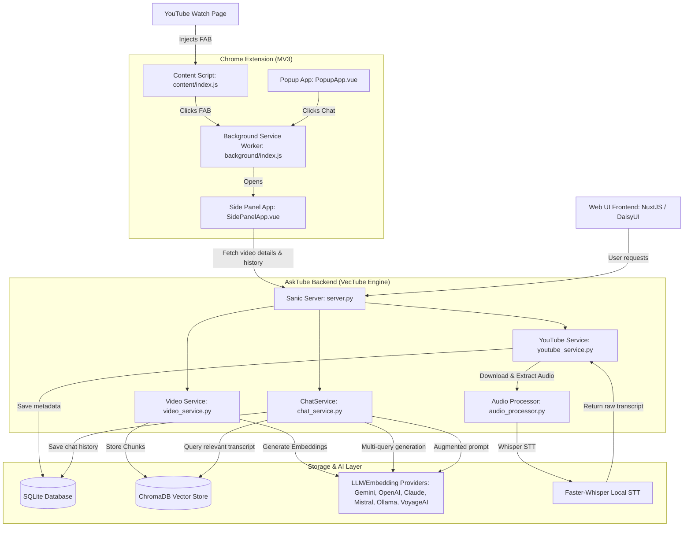

# VecTube

VecTube is a production-grade, AI-powered YouTube video summarizer and Q&A assistant powered by Retrieval Augmented Generation (RAG). It enables users to summarize long video contents and interact directly with a chat interface to ask granular questions about the transcript. It can be run 100% locally using open-source models (Ollama, Faster-Whisper, Sentence-Transformers) or connected to cloud providers (OpenAI, Gemini, Claude, Mistral, VoyageAI).

## 🏃 Demo & Interface

The system features two frontends that connect to the core Python backend engine:
1. **Chrome Extension (Recommended)**: Integrates directly into `youtube.com` watch pages with a floating Action Button (FAB) that triggers a native Side Panel UI for chat and summary.
2. **Web Application**: A standalone Nuxt.js dashboard for managing and analyzing processed videos.

---

## 💡 Architecture

The project consists of three core components communicating via REST APIs:
1. **Chrome Extension**: Leverages a **Content Script** to inject UI elements on YouTube watch pages, a **Background Service Worker** to handle extension message routing and Side Panel lifecycle, and a reactive **Vue 3/Vite/DaisyUI** side panel.
2. **Nuxt Web App**: A responsive dashboard containing detailed video summaries, transcription indices, and chat logs.
3. **AskTube Engine (Backend)**: Built with **Sanic (Python)**, utilizing **Faster-Whisper** for speech-to-text transcription, **Sentence-Transformers** for embedding calculations, **ChromaDB** for vector retrieval, and **SQLite (Peewee)** for relational storage.

### Data Flow & System Diagram



---

## 🛠️ Tech Stack

### Frontend & Chrome Extension
* **Framework**: Vue 3 (Composition API / `<script setup>`) & Nuxt 3
* **Build System**: Vite
* **Styling**: Tailwind CSS & DaisyUI
* **APIs**: Chrome Extensions Manifest V3 (Side Panel API, Runtime Messaging, Storage Sync)

### Backend Engine
* **Language & Package Manager**: Python 3.10+ & Poetry
* **Asynchronous Server**: Sanic
* **Database (Relational)**: SQLite via Peewee ORM
* **Vector Store**: ChromaDB (Persistent Client)
* **Local STT**: Faster-Whisper (Whisper Base/Tiny with float16 or int8 compute)
* **Embeddings**: Sentence-Transformers (Local: `intfloat/multilingual-e5-base`), OpenAI, Gemini, VoyageAI, Mistral

---

## 🚀 Installation & Local Setup

### Prerequisites
1. **Python**: Python 3.10 or 3.11 installed.
2. **Poetry**: Python dependency manager.
3. **Node.js & npm**: Node runtime.
4. **ffmpeg**: Required for local audio extraction (used by Whisper).
   - *Windows*: Download from [ffmpeg.org](https://www.ffmpeg.org/download.html) and add to system Path environment variable.
   - *macOS*: Run `brew install ffmpeg`.
   - *Linux*: Run `sudo apt install ffmpeg` or `sudo dnf install ffmpeg`.

---

### Step 1: Run the Backend Engine

1. Navigate to the engine directory:
   ```shell
   cd VecTube/engine
   ```
2. Copy the sample environment file to configuration:
   ```shell
   copy .env.sample .env
   ```
3. Open `.env` and fill in your AI provider API keys (e.g., `VT_GEMINI_API_KEY`, `VT_OPENAI_API_KEY`, etc.). For running locally, make sure Ollama is installed and running (`ollama run qwen2`).
4. Install Python dependencies and launch the server:
   ```shell
   poetry install
   poetry run python engine/server.py
   ```
   *The backend will run on port `http://0.0.0.0:8000`.*

---

### Step 2: Build & Load the Chrome Extension

1. Navigate to the extension directory:
   ```shell
   cd vectube-extension
   ```
2. Install dependencies:
   ```shell
   npm install
   ```
3. Compile the production package:
   ```shell
   npm run build
   ```
4. Load the unpacked extension in Google Chrome:
   - Navigate to `chrome://extensions/`.
   - Toggle **Developer mode** in the top-right corner.
   - Click **Load unpacked** in the top-left corner.
   - Select the `vectube-extension/dist` folder.

---

### Step 3: Run the Nuxt Web App (Optional)

1. Navigate to the web directory:
   ```shell
   cd VecTube/web
   ```
2. Copy the sample environment file:
   ```shell
   copy .env.sample .env
   ```
3. Install dependencies and run in development mode:
   ```shell
   npm install
   npm run dev
   ```
   *The Web application dashboard will run on `http://localhost:3000`.*

---

## 📁 Project Structure

```
extension/
├── VecTube/                     # Primary project directory
│   ├── engine/                  # Sanic Python Backend
│   │   ├── engine/              # Backend core codebase
│   │   │   ├── database/        # Peewee Models & SQLite configuration
│   │   │   ├── processors/      # Audio conversion & enhancement logic
│   │   │   ├── services/        # AI logic, Chat logic, YouTube handlers
│   │   │   └── supports/        # Configuration loader, custom loggers, prompts
│   │   ├── pyproject.toml       # Poetry configurations
│   │   └── .env                 # Local secrets configurations (Git-ignored)
│   ├── web/                     # Nuxt.js Web Frontend (dashboard)
│   └── docs/                    # Architectural image assets & manuals
├── vectube-extension/           # Chrome Extension
│   ├── dist/                    # Compiled assets folder (load in Chrome)
│   ├── src/                     # Vue 3 codebase
│   │   ├── background/          # Manifest V3 service worker (messaging)
│   │   ├── content/             # DOM-injected script (YouTube FAB detector)
│   │   ├── lib/                 # Core API clients, constants, storage utilities
│   │   ├── popup/               # Browser action pop-up panel
│   │   └── sidepanel/           # Side Panel Chat interface
│   ├── package.json             # NPM scripts & package requirements
│   └── vite.config.js           # Extension build configurations
└── README.md                    # Root workspace documentation
```

---

## 🧠 Technical Challenges Solved

### 1. YouTube SPA Navigation Handling
YouTube operates as a Single Page Application (SPA), dynamically updating URL locations without firing standard browser load events. To ensure the floating "VecTube" Action Button (FAB) is reliably injected and removed on video changes, the content script hooks directly into YouTube's internal SPA lifecycle events:
* Observes `yt-navigate-finish` custom window events.
* Fallbacks to standard HTML5 `popstate` events for back/forward navigation.
* Updates video state dynamically without page reloads.

### 2. Multi-Query RAG Expansion
User queries are often short or missing context. To optimize retrieval similarity matches against the transcript, the backend implements a **Query Expansion** step:
* Formulates a specialized instruction prompt detailing the video title, description, and chat context.
* Instructs the LLM to generate 5 variations of the question exploring different granularities and vocabulary.
* Vector searches are parallelized against ChromaDB for all 5 expanded queries, filtering duplicates using SHA-256 deduplication, producing a robust and highly context-aware text chunk payload.

### 3. Asynchronous Chrome Messaging & Context Persistence
Popup panels in Chrome close instantly when losing focus, terminating all state. To resolve this:
* State-critical actions (like opening the Side Panel or requesting background data) send message payloads to `background/index.js` using `chrome.runtime.sendMessage`.
* The background service worker queries the active Chrome tab to obtain a valid `tab.id` and executes `chrome.sidePanel.open({ tabId })`.
* A 500ms debounce allows the side panel component to mount before the background worker fires the video metadata payload, ensuring seamless user experiences.

---

## 🔮 Future Roadmap
* **Streaming Responses**: Refactor backend Sanic routes and extension API fetch scripts to support Server-Sent Events (SSE) for word-by-word token streaming.
* **Hybrid Retrieval**: Combine vector search (ChromaDB cosine similarity) with sparse BM25 lexical keyword search to handle domain-specific terminology better.
* **Reranking**: Integrate VoyageAI or Cohere Rerankers to score retrieved text chunks before constructing the prompt context.
* **Cloud Scaling**: Migration guidelines for containerizing and hosting the engine on Kubernetes/ECS with persistent PostgreSQL storage.

---

## 📄 License
This project is open-source and licensed under the MIT License. See [LICENSE](VecTube/LICENSE) for more details.

## 🤝 Acknowledgements
Special thanks to:
* The [pytubefix](https://github.com/JuanBindez/pytubefix) maintainers for active YouTube scraping adjustments.
* Google Gemini API team for high-throughput free tier developer endpoints.
